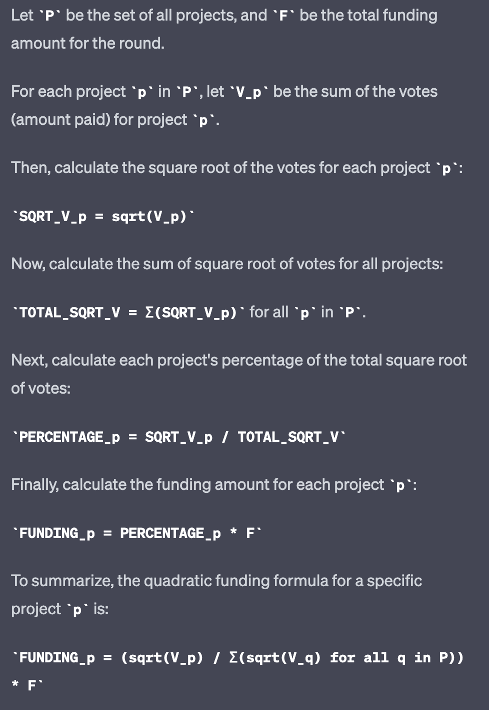

# Quadtratic Funding Spec

This repository is a proof-of-concept for a customized quadratic funding protocol.

This protocol must meet certain requirements:
* Funding will commence in "rounds" that will begin and end at specific date & time intervals
* Funders will allocate a lump sum of funds to the funding round, to be distributed algorithmically upon its conclusion
* The funds will NOT be hosted in escrow during the funding round (beta release)
* Projects seeking admission to the funding round must be approved before entering the funding round
* Projects can be approved during an active funding round and entered in the round

## Flow

Projects can apply for an upcoming or active funding round anytime.

Their application must meet certain requirements:
* Basic information (project name, etc.)
* Proposal document according to pre-defined standard

Their proposal must be reviewed by the funding organization
* This will be a manual process, where organization members will periodically review and request changes
* 💡 Perhaps notifications can be configured for this?

Once a funding round begins, users on the platform will cast "votes" in the form of SOL payments.
These "votes" will count toward the Quadratic Funding Algorithm.

## Algorithm

Stipulations:
* Each **single payment** - regardless of amount - is **one vote**.
* A user **can only vote once**.
* ⚠️ Safeguards must be in place to protect against Sybil attacks.

Algorithm:
1. Calculate the total votes for each project:  
Iterate through all the votes and add the amount paid for each vote to the respective project's total votes.

2. Calculate the square root of each project's total votes:  
Quadratic funding emphasizes smaller contributions from a large number of people. To achieve this, apply a square root to the total votes of each project. By taking the square root, the impact of larger contributions relative to the smaller ones is reduced.

3. Calculate the sum of square roots of total votes for all projects:  
Add up the square roots of total votes of all the projects. This value is used to normalize the project distribution percentages and ensures that the funding is divided amongst all the projects.

4. Calculate each project's percentage of the total square root votes:  
Divide each project's square root of total votes by the total square root votes for all projects. This gives the percentage of the total funding that the project should receive.

5. Calculate the funding amount for each project:  
Multiply each project's percentage calculated in the previous step by the total funding amount allocated for the round. This gives the final funding amount for each project.

I've asked ChatGPT to put it into a formula, if that helps:

## Escrowing (Future)

As this protocol rolls out in a "soft launch", escrowing should not be required to commence a funding round, 
but one day it should be.
Adding escrow functionality in the future should be a simple plug-and-play.

It can even be integrated as part of the core functionality, but only used when the funding round closes and payments
are disbursed.

## Sybil Resistance